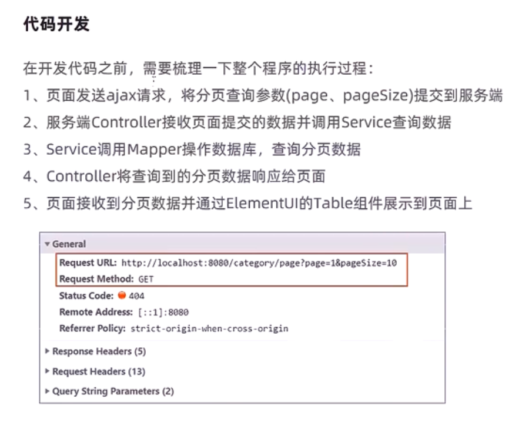
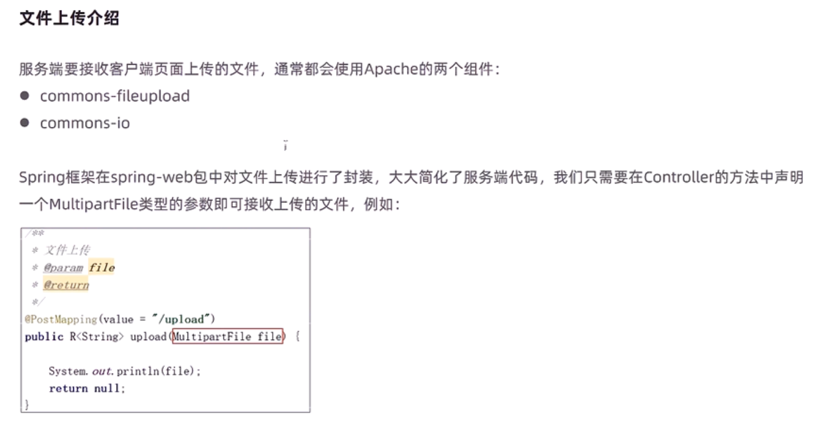

[TOC]


# 瑞吉外卖

本项目来自黑马，侵权请联系


# 整体介绍

图片资源都在`pictures`目录下，网页上看不见的，下载到本地，用typora打开，设置图片的加载路径从当前目录开始即可。


## 软件开发流程介绍

1. 流程


2. 角色分工

   

   

3. 软件环境

   - [ ] 开发环境
   - [ ] 测试环境
   - [ ] 生产环境

   


## 项目介绍


## 产品原型


* 产品原型主要用于展示项目的功能，并不是最终的页面效果。


## 技术选型


## 功能架构


## 角色（用户）


# 开发环境搭建


## 数据库环境


1. 建库


2. 建表

   ```mysql
   /*
   Navicat MySQL Data Transfer
   
   Source Server         : localhost
   Source Server Version : 50728
   Source Host           : localhost:3306
   Source Database       : reggie
   
   Target Server Type    : MYSQL
   Target Server Version : 50728
   File Encoding         : 65001
   
   Date: 2021-07-23 10:41:41
   */
   
   SET FOREIGN_KEY_CHECKS=0;
   
   -- ----------------------------
   -- Table structure for address_book
   -- ----------------------------
   DROP TABLE IF EXISTS `address_book`;
   CREATE TABLE `address_book` (
     `id` bigint(20) NOT NULL COMMENT '主键',
     `user_id` bigint(20) NOT NULL COMMENT '用户id',
     `consignee` varchar(50) COLLATE utf8_bin NOT NULL COMMENT '收货人',
     `sex` tinyint(4) NOT NULL COMMENT '性别 0 女 1 男',
     `phone` varchar(11) COLLATE utf8_bin NOT NULL COMMENT '手机号',
     `province_code` varchar(12) CHARACTER SET utf8mb4 DEFAULT NULL COMMENT '省级区划编号',
     `province_name` varchar(32) CHARACTER SET utf8mb4 DEFAULT NULL COMMENT '省级名称',
     `city_code` varchar(12) CHARACTER SET utf8mb4 DEFAULT NULL COMMENT '市级区划编号',
     `city_name` varchar(32) CHARACTER SET utf8mb4 DEFAULT NULL COMMENT '市级名称',
     `district_code` varchar(12) CHARACTER SET utf8mb4 DEFAULT NULL COMMENT '区级区划编号',
     `district_name` varchar(32) CHARACTER SET utf8mb4 DEFAULT NULL COMMENT '区级名称',
     `detail` varchar(200) CHARACTER SET utf8mb4 DEFAULT NULL COMMENT '详细地址',
     `label` varchar(100) CHARACTER SET utf8mb4 DEFAULT NULL COMMENT '标签',
     `is_default` tinyint(1) NOT NULL DEFAULT '0' COMMENT '默认 0 否 1是',
     `create_time` datetime NOT NULL COMMENT '创建时间',
     `update_time` datetime NOT NULL COMMENT '更新时间',
     `create_user` bigint(20) NOT NULL COMMENT '创建人',
     `update_user` bigint(20) NOT NULL COMMENT '修改人',
     `is_deleted` int(11) NOT NULL DEFAULT '0' COMMENT '是否删除',
     PRIMARY KEY (`id`) USING BTREE
   ) ENGINE=InnoDB DEFAULT CHARSET=utf8 COLLATE=utf8_bin COMMENT='地址管理';
   
   -- ----------------------------
   -- Records of address_book
   -- ----------------------------
   INSERT INTO `address_book` VALUES ('1417414526093082626', '1417012167126876162', '小明', '1', '13812345678', null, null, null, null, null, null, '昌平区金燕龙办公楼', '公司', '1', '2021-07-20 17:22:12', '2021-07-20 17:26:33', '1417012167126876162', '1417012167126876162', '0');
   INSERT INTO `address_book` VALUES ('1417414926166769666', '1417012167126876162', '小李', '1', '13512345678', null, null, null, null, null, null, '测试', '家', '0', '2021-07-20 17:23:47', '2021-07-20 17:23:47', '1417012167126876162', '1417012167126876162', '0');
   
   -- ----------------------------
   -- Table structure for category
   -- ----------------------------
   DROP TABLE IF EXISTS `category`;
   CREATE TABLE `category` (
     `id` bigint(20) NOT NULL COMMENT '主键',
     `type` int(11) DEFAULT NULL COMMENT '类型   1 菜品分类 2 套餐分类',
     `name` varchar(64) COLLATE utf8_bin NOT NULL COMMENT '分类名称',
     `sort` int(11) NOT NULL DEFAULT '0' COMMENT '顺序',
     `create_time` datetime NOT NULL COMMENT '创建时间',
     `update_time` datetime NOT NULL COMMENT '更新时间',
     `create_user` bigint(20) NOT NULL COMMENT '创建人',
     `update_user` bigint(20) NOT NULL COMMENT '修改人',
     PRIMARY KEY (`id`) USING BTREE,
     UNIQUE KEY `idx_category_name` (`name`)
   ) ENGINE=InnoDB DEFAULT CHARSET=utf8 COLLATE=utf8_bin COMMENT='菜品及套餐分类';
   
   -- ----------------------------
   -- Records of category
   -- ----------------------------
   INSERT INTO `category` VALUES ('1397844263642378242', '1', '湘菜', '1', '2021-05-27 09:16:58', '2021-07-15 20:25:23', '1', '1');
   INSERT INTO `category` VALUES ('1397844303408574465', '1', '川菜', '2', '2021-05-27 09:17:07', '2021-06-02 14:27:22', '1', '1');
   INSERT INTO `category` VALUES ('1397844391040167938', '1', '粤菜', '3', '2021-05-27 09:17:28', '2021-07-09 14:37:13', '1', '1');
   INSERT INTO `category` VALUES ('1413341197421846529', '1', '饮品', '11', '2021-07-09 11:36:15', '2021-07-09 14:39:15', '1', '1');
   INSERT INTO `category` VALUES ('1413342269393674242', '2', '商务套餐', '5', '2021-07-09 11:40:30', '2021-07-09 14:43:45', '1', '1');
   INSERT INTO `category` VALUES ('1413384954989060097', '1', '主食', '12', '2021-07-09 14:30:07', '2021-07-09 14:39:19', '1', '1');
   INSERT INTO `category` VALUES ('1413386191767674881', '2', '儿童套餐', '6', '2021-07-09 14:35:02', '2021-07-09 14:39:05', '1', '1');
   
   -- ----------------------------
   -- Table structure for dish
   -- ----------------------------
   DROP TABLE IF EXISTS `dish`;
   CREATE TABLE `dish` (
     `id` bigint(20) NOT NULL COMMENT '主键',
     `name` varchar(64) COLLATE utf8_bin NOT NULL COMMENT '菜品名称',
     `category_id` bigint(20) NOT NULL COMMENT '菜品分类id',
     `price` decimal(10,2) DEFAULT NULL COMMENT '菜品价格',
     `code` varchar(64) COLLATE utf8_bin NOT NULL COMMENT '商品码',
     `image` varchar(200) COLLATE utf8_bin NOT NULL COMMENT '图片',
     `description` varchar(400) COLLATE utf8_bin DEFAULT NULL COMMENT '描述信息',
     `status` int(11) NOT NULL DEFAULT '1' COMMENT '0 停售 1 起售',
     `sort` int(11) NOT NULL DEFAULT '0' COMMENT '顺序',
     `create_time` datetime NOT NULL COMMENT '创建时间',
     `update_time` datetime NOT NULL COMMENT '更新时间',
     `create_user` bigint(20) NOT NULL COMMENT '创建人',
     `update_user` bigint(20) NOT NULL COMMENT '修改人',
     `is_deleted` int(11) NOT NULL DEFAULT '0' COMMENT '是否删除',
     PRIMARY KEY (`id`) USING BTREE,
     UNIQUE KEY `idx_dish_name` (`name`)
   ) ENGINE=InnoDB DEFAULT CHARSET=utf8 COLLATE=utf8_bin COMMENT='菜品管理';
   
   -- ----------------------------
   -- Records of dish
   -- ----------------------------
   INSERT INTO `dish` VALUES ('1397849739276890114', '辣子鸡', '1397844263642378242', '7800.00', '222222222', 'f966a38e-0780-40be-bb52-5699d13cb3d9.jpg', '来自鲜嫩美味的小鸡，值得一尝', '1', '0', '2021-05-27 09:38:43', '2021-05-27 09:38:43', '1', '1', '0');
   INSERT INTO `dish` VALUES ('1397850140982161409', '毛氏红烧肉', '1397844263642378242', '6800.00', '123412341234', '0a3b3288-3446-4420-bbff-f263d0c02d8e.jpg', '毛氏红烧肉毛氏红烧肉，确定不来一份？', '1', '0', '2021-05-27 09:40:19', '2021-05-27 09:40:19', '1', '1', '0');
   INSERT INTO `dish` VALUES ('1397850392090947585', '组庵鱼翅', '1397844263642378242', '4800.00', '123412341234', '740c79ce-af29-41b8-b78d-5f49c96e38c4.jpg', '组庵鱼翅，看图足以表明好吃程度', '1', '0', '2021-05-27 09:41:19', '2021-05-27 09:41:19', '1', '1', '0');
   INSERT INTO `dish` VALUES ('1397850851245600769', '霸王别姬', '1397844263642378242', '12800.00', '123412341234', '057dd338-e487-4bbc-a74c-0384c44a9ca3.jpg', '还有什么比霸王别姬更美味的呢？', '1', '0', '2021-05-27 09:43:08', '2021-05-27 09:43:08', '1', '1', '0');
   INSERT INTO `dish` VALUES ('1397851099502260226', '全家福', '1397844263642378242', '11800.00', '23412341234', 'a53a4e6a-3b83-4044-87f9-9d49b30a8fdc.jpg', '别光吃肉啦，来份全家福吧，让你长寿又美味', '1', '0', '2021-05-27 09:44:08', '2021-05-27 09:44:08', '1', '1', '0');
   INSERT INTO `dish` VALUES ('1397851370462687234', '邵阳猪血丸子', '1397844263642378242', '13800.00', '1246812345678', '2a50628e-7758-4c51-9fbb-d37c61cdacad.jpg', '看，美味不？来嘛来嘛，这才是最爱吖', '1', '0', '2021-05-27 09:45:12', '2021-05-27 09:45:12', '1', '1', '0');
   INSERT INTO `dish` VALUES ('1397851668262465537', '口味蛇', '1397844263642378242', '16800.00', '1234567812345678', '0f4bd884-dc9c-4cf9-b59e-7d5958fec3dd.jpg', '爬行界的扛把子，东兴-口味蛇，让你欲罢不能', '1', '0', '2021-05-27 09:46:23', '2021-05-27 09:46:23', '1', '1', '0');
   INSERT INTO `dish` VALUES ('1397852391150759938', '辣子鸡丁', '1397844303408574465', '8800.00', '2346812468', 'ef2b73f2-75d1-4d3a-beea-22da0e1421bd.jpg', '辣子鸡丁，辣子鸡丁，永远的魂', '1', '0', '2021-05-27 09:49:16', '2021-05-27 09:49:16', '1', '1', '0');
   INSERT INTO `dish` VALUES ('1397853183287013378', '麻辣兔头', '1397844303408574465', '19800.00', '123456787654321', '2a2e9d66-b41d-4645-87bd-95f2cfeed218.jpg', '麻辣兔头的详细制作，麻辣鲜香，色泽红润，回味悠长', '1', '0', '2021-05-27 09:52:24', '2021-05-27 09:52:24', '1', '1', '0');
   INSERT INTO `dish` VALUES ('1397853709101740034', '蒜泥白肉', '1397844303408574465', '9800.00', '1234321234321', 'd2f61d70-ac85-4529-9b74-6d9a2255c6d7.jpg', '多么的有食欲啊', '1', '0', '2021-05-27 09:54:30', '2021-05-27 09:54:30', '1', '1', '0');
   INSERT INTO `dish` VALUES ('1397853890262118402', '鱼香肉丝', '1397844303408574465', '3800.00', '1234212321234', '8dcfda14-5712-4d28-82f7-ae905b3c2308.jpg', '鱼香肉丝简直就是我们童年回忆的一道经典菜，上学的时候点个鱼香肉丝盖饭坐在宿舍床上看着肥皂剧，绝了！现在完美复刻一下上学的时候感觉', '1', '0', '2021-05-27 09:55:13', '2021-05-27 09:55:13', '1', '1', '0');
   INSERT INTO `dish` VALUES ('1397854652581064706', '麻辣水煮鱼', '1397844303408574465', '14800.00', '2345312·345321', '1fdbfbf3-1d86-4b29-a3fc-46345852f2f8.jpg', '鱼片是买的切好的鱼片，放几个虾，增加味道', '1', '0', '2021-05-27 09:58:15', '2021-05-27 09:58:15', '1', '1', '0');
   INSERT INTO `dish` VALUES ('1397854865672679425', '鱼香炒鸡蛋', '1397844303408574465', '2000.00', '23456431·23456', '0f252364-a561-4e8d-8065-9a6797a6b1d3.jpg', '鱼香菜也是川味的特色。里面没有鱼却鱼香味', '1', '0', '2021-05-27 09:59:06', '2021-05-27 09:59:06', '1', '1', '0');
   INSERT INTO `dish` VALUES ('1397860242057375745', '脆皮烧鹅', '1397844391040167938', '12800.00', '123456786543213456', 'e476f679-5c15-436b-87fa-8c4e9644bf33.jpeg', '“广东烤鸭美而香，却胜烧鹅说古冈（今新会），燕瘦环肥各佳妙，君休偏重便宜坊”，可见烧鹅与烧鸭在粤菜之中已早负盛名。作为广州最普遍和最受欢迎的烧烤肉食，以它的“色泽金红，皮脆肉嫩，味香可口”的特色，在省城各大街小巷的烧卤店随处可见。', '1', '0', '2021-05-27 10:20:27', '2021-05-27 10:20:27', '1', '1', '0');
   INSERT INTO `dish` VALUES ('1397860578738352129', '白切鸡', '1397844391040167938', '6600.00', '12345678654', '9ec6fc2d-50d2-422e-b954-de87dcd04198.jpeg', '白切鸡是一道色香味俱全的特色传统名肴，又叫白斩鸡，是粤菜系鸡肴中的一种，始于清代的民间。白切鸡通常选用细骨农家鸡与沙姜、蒜茸等食材，慢火煮浸白切鸡皮爽肉滑，清淡鲜美。著名的泮溪酒家白切鸡，曾获商业部优质产品金鼎奖。湛江白切鸡更是驰名粤港澳。粤菜厨坛中，鸡的菜式有200余款之多，而最为人常食不厌的正是白切鸡，深受食家青睐。', '1', '0', '2021-05-27 10:21:48', '2021-05-27 10:21:48', '1', '1', '0');
   INSERT INTO `dish` VALUES ('1397860792492666881', '烤乳猪', '1397844391040167938', '38800.00', '213456432123456', '2e96a7e3-affb-438e-b7c3-e1430df425c9.jpeg', '广式烧乳猪主料是小乳猪，辅料是蒜，调料是五香粉、芝麻酱、八角粉等，本菜品主要通过将食材放入炭火中烧烤而成。烤乳猪是广州最著名的特色菜，并且是“满汉全席”中的主打菜肴之一。烤乳猪也是许多年来广东人祭祖的祭品之一，是家家都少不了的应节之物，用乳猪祭完先人后，亲戚们再聚餐食用。', '1', '0', '2021-05-27 10:22:39', '2021-05-27 10:22:39', '1', '1', '0');
   INSERT INTO `dish` VALUES ('1397860963880316929', '脆皮乳鸽', '1397844391040167938', '10800.00', '1234563212345', '3fabb83a-1c09-4fd9-892b-4ef7457daafa.jpeg', '“脆皮乳鸽”是广东菜中的一道传统名菜，属于粤菜系，具有皮脆肉嫩、色泽红亮、鲜香味美的特点，常吃可使身体强健，清肺顺气。随着菜品制作工艺的不断发展，逐渐形成了熟炸法、生炸法和烤制法三种制作方法。无论那种制作方法，都是在鸽子经过一系列的加工，挂脆皮水后再加工而成，正宗的“脆皮乳鸽皮脆肉嫩、色泽红亮、鲜香味美、香气馥郁。这三种方法的制作过程都不算复杂，但想达到理想的效果并不容易。', '1', '0', '2021-05-27 10:23:19', '2021-05-27 10:23:19', '1', '1', '0');
   INSERT INTO `dish` VALUES ('1397861683434139649', '清蒸河鲜海鲜', '1397844391040167938', '38800.00', '1234567876543213456', '1405081e-f545-42e1-86a2-f7559ae2e276.jpeg', '新鲜的海鲜，清蒸是最好的处理方式。鲜，体会为什么叫海鲜。清蒸是广州最经典的烹饪手法，过去岭南地区由于峻山大岭阻隔，交通不便，经济发展起步慢，自家打的鱼放在锅里煮了就吃，没有太多的讲究，但却发现这清淡的煮法能使鱼的鲜甜跃然舌尖。', '1', '0', '2021-05-27 10:26:11', '2021-05-27 10:26:11', '1', '1', '0');
   INSERT INTO `dish` VALUES ('1397862198033297410', '老火靓汤', '1397844391040167938', '49800.00', '123456786532455', '583df4b7-a159-4cfc-9543-4f666120b25f.jpeg', '老火靓汤又称广府汤，是广府人传承数千年的食补养生秘方，慢火煲煮的中华老火靓汤，火候足，时间长，既取药补之效，又取入口之甘甜。 广府老火汤种类繁多，可以用各种汤料和烹调方法，烹制出各种不同口味、不同功效的汤来。', '1', '0', '2021-05-27 10:28:14', '2021-05-27 10:28:14', '1', '1', '0');
   INSERT INTO `dish` VALUES ('1397862477831122945', '上汤焗龙虾', '1397844391040167938', '108800.00', '1234567865432', '5b8d2da3-3744-4bb3-acdc-329056b8259d.jpeg', '上汤焗龙虾是一道色香味俱全的传统名菜，属于粤菜系。此菜以龙虾为主料，配以高汤制成的一道海鲜美食。本品肉质洁白细嫩，味道鲜美，蛋白质含量高，脂肪含量低，营养丰富。是色香味俱全的传统名菜。', '1', '0', '2021-05-27 10:29:20', '2021-05-27 10:29:20', '1', '1', '0');
   INSERT INTO `dish` VALUES ('1413342036832100354', '北冰洋', '1413341197421846529', '500.00', '', 'c99e0aab-3cb7-4eaa-80fd-f47d4ffea694.png', '', '1', '0', '2021-07-09 11:39:35', '2021-07-09 15:12:18', '1', '1', '0');
   INSERT INTO `dish` VALUES ('1413384757047271425', '王老吉', '1413341197421846529', '500.00', '', '00874a5e-0df2-446b-8f69-a30eb7d88ee8.png', '', '1', '0', '2021-07-09 14:29:20', '2021-07-12 09:09:16', '1', '1', '0');
   INSERT INTO `dish` VALUES ('1413385247889891330', '米饭', '1413384954989060097', '200.00', '', 'ee04a05a-1230-46b6-8ad5-1a95b140fff3.png', '', '1', '0', '2021-07-09 14:31:17', '2021-07-11 16:35:26', '1', '1', '0');
   
   -- ----------------------------
   -- Table structure for dish_flavor
   -- ----------------------------
   DROP TABLE IF EXISTS `dish_flavor`;
   CREATE TABLE `dish_flavor` (
     `id` bigint(20) NOT NULL COMMENT '主键',
     `dish_id` bigint(20) NOT NULL COMMENT '菜品',
     `name` varchar(64) COLLATE utf8_bin NOT NULL COMMENT '口味名称',
     `value` varchar(500) COLLATE utf8_bin DEFAULT NULL COMMENT '口味数据list',
     `create_time` datetime NOT NULL COMMENT '创建时间',
     `update_time` datetime NOT NULL COMMENT '更新时间',
     `create_user` bigint(20) NOT NULL COMMENT '创建人',
     `update_user` bigint(20) NOT NULL COMMENT '修改人',
     `is_deleted` int(11) NOT NULL DEFAULT '0' COMMENT '是否删除',
     PRIMARY KEY (`id`) USING BTREE
   ) ENGINE=InnoDB DEFAULT CHARSET=utf8 COLLATE=utf8_bin COMMENT='菜品口味关系表';
   
   -- ----------------------------
   -- Records of dish_flavor
   -- ----------------------------
   INSERT INTO `dish_flavor` VALUES ('1397849417888346113', '1397849417854791681', '辣度', '[\"不辣\",\"微辣\",\"中辣\",\"重辣\"]', '2021-05-27 09:37:27', '2021-05-27 09:37:27', '1', '1', '0');
   INSERT INTO `dish_flavor` VALUES ('1397849739297861633', '1397849739276890114', '忌口', '[\"不要葱\",\"不要蒜\",\"不要香菜\",\"不要辣\"]', '2021-05-27 09:38:43', '2021-05-27 09:38:43', '1', '1', '0');
   INSERT INTO `dish_flavor` VALUES ('1397849739323027458', '1397849739276890114', '辣度', '[\"不辣\",\"微辣\",\"中辣\",\"重辣\"]', '2021-05-27 09:38:43', '2021-05-27 09:38:43', '1', '1', '0');
   INSERT INTO `dish_flavor` VALUES ('1397849936421761025', '1397849936404983809', '忌口', '[\"不要葱\",\"不要蒜\",\"不要香菜\",\"不要辣\"]', '2021-05-27 09:39:30', '2021-05-27 09:39:30', '1', '1', '0');
   INSERT INTO `dish_flavor` VALUES ('1397849936438538241', '1397849936404983809', '辣度', '[\"不辣\",\"微辣\",\"中辣\",\"重辣\"]', '2021-05-27 09:39:30', '2021-05-27 09:39:30', '1', '1', '0');
   INSERT INTO `dish_flavor` VALUES ('1397850141015715841', '1397850140982161409', '忌口', '[\"不要葱\",\"不要蒜\",\"不要香菜\",\"不要辣\"]', '2021-05-27 09:40:19', '2021-05-27 09:40:19', '1', '1', '0');
   INSERT INTO `dish_flavor` VALUES ('1397850141040881665', '1397850140982161409', '辣度', '[\"不辣\",\"微辣\",\"中辣\",\"重辣\"]', '2021-05-27 09:40:19', '2021-05-27 09:40:19', '1', '1', '0');
   INSERT INTO `dish_flavor` VALUES ('1397850392120307713', '1397850392090947585', '辣度', '[\"不辣\",\"微辣\",\"中辣\",\"重辣\"]', '2021-05-27 09:41:19', '2021-05-27 09:41:19', '1', '1', '0');
   INSERT INTO `dish_flavor` VALUES ('1397850392137084929', '1397850392090947585', '辣度', '[\"不辣\",\"微辣\",\"中辣\",\"重辣\"]', '2021-05-27 09:41:19', '2021-05-27 09:41:19', '1', '1', '0');
   INSERT INTO `dish_flavor` VALUES ('1397850630734262274', '1397850630700707841', '忌口', '[\"不要葱\",\"不要蒜\",\"不要香菜\",\"不要辣\"]', '2021-05-27 09:42:16', '2021-05-27 09:42:16', '1', '1', '0');
   INSERT INTO `dish_flavor` VALUES ('1397850630755233794', '1397850630700707841', '辣度', '[\"微辣\",\"中辣\",\"重辣\"]', '2021-05-27 09:42:16', '2021-05-27 09:42:16', '1', '1', '0');
   INSERT INTO `dish_flavor` VALUES ('1397850851274960898', '1397850851245600769', '忌口', '[\"不要蒜\",\"不要香菜\",\"不要辣\"]', '2021-05-27 09:43:08', '2021-05-27 09:43:08', '1', '1', '0');
   INSERT INTO `dish_flavor` VALUES ('1397850851283349505', '1397850851245600769', '辣度', '[\"不辣\",\"微辣\",\"中辣\",\"重辣\"]', '2021-05-27 09:43:08', '2021-05-27 09:43:08', '1', '1', '0');
   INSERT INTO `dish_flavor` VALUES ('1397851099523231745', '1397851099502260226', '忌口', '[\"不要葱\",\"不要蒜\",\"不要香菜\",\"不要辣\"]', '2021-05-27 09:44:08', '2021-05-27 09:44:08', '1', '1', '0');
   INSERT INTO `dish_flavor` VALUES ('1397851099527426050', '1397851099502260226', '辣度', '[\"不辣\",\"微辣\",\"中辣\"]', '2021-05-27 09:44:08', '2021-05-27 09:44:08', '1', '1', '0');
   INSERT INTO `dish_flavor` VALUES ('1397851370483658754', '1397851370462687234', '温度', '[\"热饮\",\"常温\",\"去冰\",\"少冰\",\"多冰\"]', '2021-05-27 09:45:12', '2021-05-27 09:45:12', '1', '1', '0');
   INSERT INTO `dish_flavor` VALUES ('1397851370483658755', '1397851370462687234', '忌口', '[\"不要葱\",\"不要蒜\",\"不要香菜\",\"不要辣\"]', '2021-05-27 09:45:12', '2021-05-27 09:45:12', '1', '1', '0');
   INSERT INTO `dish_flavor` VALUES ('1397851370483658756', '1397851370462687234', '辣度', '[\"不辣\",\"微辣\",\"中辣\",\"重辣\"]', '2021-05-27 09:45:12', '2021-05-27 09:45:12', '1', '1', '0');
   INSERT INTO `dish_flavor` VALUES ('1397851668283437058', '1397851668262465537', '温度', '[\"热饮\",\"常温\",\"去冰\",\"少冰\",\"多冰\"]', '2021-05-27 09:46:23', '2021-05-27 09:46:23', '1', '1', '0');
   INSERT INTO `dish_flavor` VALUES ('1397852391180120065', '1397852391150759938', '忌口', '[\"不要葱\",\"不要香菜\",\"不要辣\"]', '2021-05-27 09:49:16', '2021-05-27 09:49:16', '1', '1', '0');
   INSERT INTO `dish_flavor` VALUES ('1397852391196897281', '1397852391150759938', '辣度', '[\"不辣\",\"微辣\",\"重辣\"]', '2021-05-27 09:49:16', '2021-05-27 09:49:16', '1', '1', '0');
   INSERT INTO `dish_flavor` VALUES ('1397853183307984898', '1397853183287013378', '辣度', '[\"不辣\",\"微辣\",\"中辣\",\"重辣\"]', '2021-05-27 09:52:24', '2021-05-27 09:52:24', '1', '1', '0');
   INSERT INTO `dish_flavor` VALUES ('1397853423486414850', '1397853423461249026', '辣度', '[\"不辣\",\"微辣\",\"中辣\",\"重辣\"]', '2021-05-27 09:53:22', '2021-05-27 09:53:22', '1', '1', '0');
   INSERT INTO `dish_flavor` VALUES ('1397853709126905857', '1397853709101740034', '忌口', '[\"不要葱\",\"不要蒜\",\"不要香菜\",\"不要辣\"]', '2021-05-27 09:54:30', '2021-05-27 09:54:30', '1', '1', '0');
   INSERT INTO `dish_flavor` VALUES ('1397853890283089922', '1397853890262118402', '辣度', '[\"不辣\",\"微辣\",\"中辣\",\"重辣\"]', '2021-05-27 09:55:13', '2021-05-27 09:55:13', '1', '1', '0');
   INSERT INTO `dish_flavor` VALUES ('1397854133632413697', '1397854133603053569', '温度', '[\"热饮\",\"常温\",\"去冰\",\"少冰\",\"多冰\"]', '2021-05-27 09:56:11', '2021-05-27 09:56:11', '1', '1', '0');
   INSERT INTO `dish_flavor` VALUES ('1397854652623007745', '1397854652581064706', '忌口', '[\"不要葱\",\"不要蒜\",\"不要香菜\",\"不要辣\"]', '2021-05-27 09:58:15', '2021-05-27 09:58:15', '1', '1', '0');
   INSERT INTO `dish_flavor` VALUES ('1397854652635590658', '1397854652581064706', '辣度', '[\"不辣\",\"微辣\",\"中辣\",\"重辣\"]', '2021-05-27 09:58:15', '2021-05-27 09:58:15', '1', '1', '0');
   INSERT INTO `dish_flavor` VALUES ('1397854865735593986', '1397854865672679425', '辣度', '[\"不辣\",\"微辣\",\"中辣\",\"重辣\"]', '2021-05-27 09:59:06', '2021-05-27 09:59:06', '1', '1', '0');
   INSERT INTO `dish_flavor` VALUES ('1397855742303186946', '1397855742273826817', '辣度', '[\"不辣\",\"微辣\",\"中辣\",\"重辣\"]', '2021-05-27 10:02:35', '2021-05-27 10:02:35', '1', '1', '0');
   INSERT INTO `dish_flavor` VALUES ('1397855906497605633', '1397855906468245506', '忌口', '[\"不要葱\",\"不要蒜\",\"不要香菜\",\"不要辣\"]', '2021-05-27 10:03:14', '2021-05-27 10:03:14', '1', '1', '0');
   INSERT INTO `dish_flavor` VALUES ('1397856190573621250', '1397856190540066818', '辣度', '[\"不辣\",\"微辣\",\"中辣\",\"重辣\"]', '2021-05-27 10:04:21', '2021-05-27 10:04:21', '1', '1', '0');
   INSERT INTO `dish_flavor` VALUES ('1397859056709316609', '1397859056684150785', '辣度', '[\"不辣\",\"微辣\",\"中辣\",\"重辣\"]', '2021-05-27 10:15:45', '2021-05-27 10:15:45', '1', '1', '0');
   INSERT INTO `dish_flavor` VALUES ('1397859277837217794', '1397859277812051969', '辣度', '[\"不辣\",\"微辣\",\"中辣\",\"重辣\"]', '2021-05-27 10:16:37', '2021-05-27 10:16:37', '1', '1', '0');
   INSERT INTO `dish_flavor` VALUES ('1397859487502086146', '1397859487476920321', '辣度', '[\"不辣\",\"微辣\",\"中辣\",\"重辣\"]', '2021-05-27 10:17:27', '2021-05-27 10:17:27', '1', '1', '0');
   INSERT INTO `dish_flavor` VALUES ('1397859757061615618', '1397859757036449794', '甜味', '[\"无糖\",\"少糖\",\"半躺\",\"多糖\",\"全糖\"]', '2021-05-27 10:18:32', '2021-05-27 10:18:32', '1', '1', '0');
   INSERT INTO `dish_flavor` VALUES ('1397860242086735874', '1397860242057375745', '辣度', '[\"不辣\",\"微辣\",\"中辣\",\"重辣\"]', '2021-05-27 10:20:27', '2021-05-27 10:20:27', '1', '1', '0');
   INSERT INTO `dish_flavor` VALUES ('1397860963918065665', '1397860963880316929', '辣度', '[\"不辣\",\"微辣\",\"中辣\",\"重辣\"]', '2021-05-27 10:23:19', '2021-05-27 10:23:19', '1', '1', '0');
   INSERT INTO `dish_flavor` VALUES ('1397861135754506242', '1397861135733534722', '甜味', '[\"无糖\",\"少糖\",\"半躺\",\"多糖\",\"全糖\"]', '2021-05-27 10:24:00', '2021-05-27 10:24:00', '1', '1', '0');
   INSERT INTO `dish_flavor` VALUES ('1397861370035744769', '1397861370010578945', '辣度', '[\"不辣\",\"微辣\",\"中辣\",\"重辣\"]', '2021-05-27 10:24:56', '2021-05-27 10:24:56', '1', '1', '0');
   INSERT INTO `dish_flavor` VALUES ('1397861683459305474', '1397861683434139649', '忌口', '[\"不要葱\",\"不要蒜\",\"不要香菜\",\"不要辣\"]', '2021-05-27 10:26:11', '2021-05-27 10:26:11', '1', '1', '0');
   INSERT INTO `dish_flavor` VALUES ('1397861898467717121', '1397861898438356993', '忌口', '[\"不要葱\",\"不要蒜\",\"不要香菜\",\"不要辣\"]', '2021-05-27 10:27:02', '2021-05-27 10:27:02', '1', '1', '0');
   INSERT INTO `dish_flavor` VALUES ('1397862198054268929', '1397862198033297410', '忌口', '[\"不要葱\",\"不要蒜\",\"不要香菜\",\"不要辣\"]', '2021-05-27 10:28:14', '2021-05-27 10:28:14', '1', '1', '0');
   INSERT INTO `dish_flavor` VALUES ('1397862477835317250', '1397862477831122945', '辣度', '[\"不辣\",\"微辣\",\"中辣\"]', '2021-05-27 10:29:20', '2021-05-27 10:29:20', '1', '1', '0');
   INSERT INTO `dish_flavor` VALUES ('1398089545865015297', '1398089545676271617', '温度', '[\"热饮\",\"常温\",\"去冰\",\"少冰\",\"多冰\"]', '2021-05-28 01:31:38', '2021-05-28 01:31:38', '1', '1', '0');
   INSERT INTO `dish_flavor` VALUES ('1398089782323097601', '1398089782285348866', '辣度', '[\"不辣\",\"微辣\",\"中辣\",\"重辣\"]', '2021-05-28 01:32:34', '2021-05-28 01:32:34', '1', '1', '0');
   INSERT INTO `dish_flavor` VALUES ('1398090003262255106', '1398090003228700673', '忌口', '[\"不要葱\",\"不要蒜\",\"不要香菜\",\"不要辣\"]', '2021-05-28 01:33:27', '2021-05-28 01:33:27', '1', '1', '0');
   INSERT INTO `dish_flavor` VALUES ('1398090264554811394', '1398090264517062657', '忌口', '[\"不要葱\",\"不要蒜\",\"不要香菜\",\"不要辣\"]', '2021-05-28 01:34:29', '2021-05-28 01:34:29', '1', '1', '0');
   INSERT INTO `dish_flavor` VALUES ('1398090455399837698', '1398090455324340225', '辣度', '[\"不辣\",\"微辣\",\"中辣\",\"重辣\"]', '2021-05-28 01:35:14', '2021-05-28 01:35:14', '1', '1', '0');
   INSERT INTO `dish_flavor` VALUES ('1398090685449023490', '1398090685419663362', '温度', '[\"热饮\",\"常温\",\"去冰\",\"少冰\",\"多冰\"]', '2021-05-28 01:36:09', '2021-05-28 01:36:09', '1', '1', '0');
   INSERT INTO `dish_flavor` VALUES ('1398090825358422017', '1398090825329061889', '忌口', '[\"不要葱\",\"不要蒜\",\"不要香菜\",\"不要辣\"]', '2021-05-28 01:36:43', '2021-05-28 01:36:43', '1', '1', '0');
   INSERT INTO `dish_flavor` VALUES ('1398091007051476993', '1398091007017922561', '辣度', '[\"不辣\",\"微辣\",\"中辣\",\"重辣\"]', '2021-05-28 01:37:26', '2021-05-28 01:37:26', '1', '1', '0');
   INSERT INTO `dish_flavor` VALUES ('1398091296164851713', '1398091296131297281', '辣度', '[\"不辣\",\"微辣\",\"中辣\",\"重辣\"]', '2021-05-28 01:38:35', '2021-05-28 01:38:35', '1', '1', '0');
   INSERT INTO `dish_flavor` VALUES ('1398091546531246081', '1398091546480914433', '忌口', '[\"不要葱\",\"不要蒜\",\"不要香菜\",\"不要辣\"]', '2021-05-28 01:39:35', '2021-05-28 01:39:35', '1', '1', '0');
   INSERT INTO `dish_flavor` VALUES ('1398091729809747969', '1398091729788776450', '辣度', '[\"不辣\",\"微辣\",\"中辣\",\"重辣\"]', '2021-05-28 01:40:18', '2021-05-28 01:40:18', '1', '1', '0');
   INSERT INTO `dish_flavor` VALUES ('1398091889499484161', '1398091889449152513', '辣度', '[\"不辣\",\"微辣\",\"中辣\",\"重辣\"]', '2021-05-28 01:40:56', '2021-05-28 01:40:56', '1', '1', '0');
   INSERT INTO `dish_flavor` VALUES ('1398092095179763713', '1398092095142014978', '辣度', '[\"不辣\",\"微辣\",\"中辣\",\"重辣\"]', '2021-05-28 01:41:45', '2021-05-28 01:41:45', '1', '1', '0');
   INSERT INTO `dish_flavor` VALUES ('1398092283877306370', '1398092283847946241', '辣度', '[\"不辣\",\"微辣\",\"中辣\",\"重辣\"]', '2021-05-28 01:42:30', '2021-05-28 01:42:30', '1', '1', '0');
   INSERT INTO `dish_flavor` VALUES ('1398094018939236354', '1398094018893099009', '辣度', '[\"不辣\",\"微辣\",\"中辣\",\"重辣\"]', '2021-05-28 01:49:24', '2021-05-28 01:49:24', '1', '1', '0');
   INSERT INTO `dish_flavor` VALUES ('1398094391494094850', '1398094391456346113', '辣度', '[\"不辣\",\"微辣\",\"中辣\",\"重辣\"]', '2021-05-28 01:50:53', '2021-05-28 01:50:53', '1', '1', '0');
   INSERT INTO `dish_flavor` VALUES ('1399574026165727233', '1399305325713600514', '辣度', '[\"不辣\",\"微辣\",\"中辣\",\"重辣\"]', '2021-06-01 03:50:25', '2021-06-01 03:50:25', '1399309715396669441', '1399309715396669441', '0');
   INSERT INTO `dish_flavor` VALUES ('1413389540592263169', '1413384757047271425', '温度', '[\"常温\",\"冷藏\"]', '2021-07-12 09:09:16', '2021-07-12 09:09:16', '1', '1', '0');
   INSERT INTO `dish_flavor` VALUES ('1413389684020682754', '1413342036832100354', '温度', '[\"常温\",\"冷藏\"]', '2021-07-09 15:12:18', '2021-07-09 15:12:18', '1', '1', '0');
   
   -- ----------------------------
   -- Table structure for employee
   -- ----------------------------
   DROP TABLE IF EXISTS `employee`;
   CREATE TABLE `employee` (
     `id` bigint(20) NOT NULL COMMENT '主键',
     `name` varchar(32) COLLATE utf8_bin NOT NULL COMMENT '姓名',
     `username` varchar(32) COLLATE utf8_bin NOT NULL COMMENT '用户名',
     `password` varchar(64) COLLATE utf8_bin NOT NULL COMMENT '密码',
     `phone` varchar(11) COLLATE utf8_bin NOT NULL COMMENT '手机号',
     `sex` varchar(2) COLLATE utf8_bin NOT NULL COMMENT '性别',
     `id_number` varchar(18) COLLATE utf8_bin NOT NULL COMMENT '身份证号',
     `status` int(11) NOT NULL DEFAULT '1' COMMENT '状态 0:禁用，1:正常',
     `create_time` datetime NOT NULL COMMENT '创建时间',
     `update_time` datetime NOT NULL COMMENT '更新时间',
     `create_user` bigint(20) NOT NULL COMMENT '创建人',
     `update_user` bigint(20) NOT NULL COMMENT '修改人',
     PRIMARY KEY (`id`) USING BTREE,
     UNIQUE KEY `idx_username` (`username`)
   ) ENGINE=InnoDB DEFAULT CHARSET=utf8 COLLATE=utf8_bin COMMENT='员工信息';
   
   -- ----------------------------
   -- Records of employee
   -- ----------------------------
   INSERT INTO `employee` VALUES ('1', '管理员', 'admin', 'e10adc3949ba59abbe56e057f20f883e', '13812312312', '1', '110101199001010047', '1', '2021-05-06 17:20:07', '2021-05-10 02:24:09', '1', '1');
   
   -- ----------------------------
   -- Table structure for orders
   -- ----------------------------
   DROP TABLE IF EXISTS `orders`;
   CREATE TABLE `orders` (
     `id` bigint(20) NOT NULL COMMENT '主键',
     `number` varchar(50) COLLATE utf8_bin DEFAULT NULL COMMENT '订单号',
     `status` int(11) NOT NULL DEFAULT '1' COMMENT '订单状态 1待付款，2待派送，3已派送，4已完成，5已取消',
     `user_id` bigint(20) NOT NULL COMMENT '下单用户',
     `address_book_id` bigint(20) NOT NULL COMMENT '地址id',
     `order_time` datetime NOT NULL COMMENT '下单时间',
     `checkout_time` datetime NOT NULL COMMENT '结账时间',
     `pay_method` int(11) NOT NULL DEFAULT '1' COMMENT '支付方式 1微信,2支付宝',
     `amount` decimal(10,2) NOT NULL COMMENT '实收金额',
     `remark` varchar(100) COLLATE utf8_bin DEFAULT NULL COMMENT '备注',
     `phone` varchar(255) COLLATE utf8_bin DEFAULT NULL,
     `address` varchar(255) COLLATE utf8_bin DEFAULT NULL,
     `user_name` varchar(255) COLLATE utf8_bin DEFAULT NULL,
     `consignee` varchar(255) COLLATE utf8_bin DEFAULT NULL,
     PRIMARY KEY (`id`) USING BTREE
   ) ENGINE=InnoDB DEFAULT CHARSET=utf8 COLLATE=utf8_bin COMMENT='订单表';
   
   -- ----------------------------
   -- Records of orders
   -- ----------------------------
   
   -- ----------------------------
   -- Table structure for order_detail
   -- ----------------------------
   DROP TABLE IF EXISTS `order_detail`;
   CREATE TABLE `order_detail` (
     `id` bigint(20) NOT NULL COMMENT '主键',
     `name` varchar(50) COLLATE utf8_bin DEFAULT NULL COMMENT '名字',
     `image` varchar(100) COLLATE utf8_bin DEFAULT NULL COMMENT '图片',
     `order_id` bigint(20) NOT NULL COMMENT '订单id',
     `dish_id` bigint(20) DEFAULT NULL COMMENT '菜品id',
     `setmeal_id` bigint(20) DEFAULT NULL COMMENT '套餐id',
     `dish_flavor` varchar(50) COLLATE utf8_bin DEFAULT NULL COMMENT '口味',
     `number` int(11) NOT NULL DEFAULT '1' COMMENT '数量',
     `amount` decimal(10,2) NOT NULL COMMENT '金额',
     PRIMARY KEY (`id`) USING BTREE
   ) ENGINE=InnoDB DEFAULT CHARSET=utf8 COLLATE=utf8_bin COMMENT='订单明细表';
   
   -- ----------------------------
   -- Records of order_detail
   -- ----------------------------
   
   -- ----------------------------
   -- Table structure for setmeal
   -- ----------------------------
   DROP TABLE IF EXISTS `setmeal`;
   CREATE TABLE `setmeal` (
     `id` bigint(20) NOT NULL COMMENT '主键',
     `category_id` bigint(20) NOT NULL COMMENT '菜品分类id',
     `name` varchar(64) COLLATE utf8_bin NOT NULL COMMENT '套餐名称',
     `price` decimal(10,2) NOT NULL COMMENT '套餐价格',
     `status` int(11) DEFAULT NULL COMMENT '状态 0:停用 1:启用',
     `code` varchar(32) COLLATE utf8_bin DEFAULT NULL COMMENT '编码',
     `description` varchar(512) COLLATE utf8_bin DEFAULT NULL COMMENT '描述信息',
     `image` varchar(255) COLLATE utf8_bin DEFAULT NULL COMMENT '图片',
     `create_time` datetime NOT NULL COMMENT '创建时间',
     `update_time` datetime NOT NULL COMMENT '更新时间',
     `create_user` bigint(20) NOT NULL COMMENT '创建人',
     `update_user` bigint(20) NOT NULL COMMENT '修改人',
     `is_deleted` int(11) NOT NULL DEFAULT '0' COMMENT '是否删除',
     PRIMARY KEY (`id`) USING BTREE,
     UNIQUE KEY `idx_setmeal_name` (`name`)
   ) ENGINE=InnoDB DEFAULT CHARSET=utf8 COLLATE=utf8_bin COMMENT='套餐';
   
   -- ----------------------------
   -- Records of setmeal
   -- ----------------------------
   INSERT INTO `setmeal` VALUES ('1415580119015145474', '1413386191767674881', '儿童套餐A计划', '4000.00', '1', '', '', '61d20592-b37f-4d72-a864-07ad5bb8f3bb.jpg', '2021-07-15 15:52:55', '2021-07-15 15:52:55', '1415576781934608386', '1415576781934608386', '0');
   
   -- ----------------------------
   -- Table structure for setmeal_dish
   -- ----------------------------
   DROP TABLE IF EXISTS `setmeal_dish`;
   CREATE TABLE `setmeal_dish` (
     `id` bigint(20) NOT NULL COMMENT '主键',
     `setmeal_id` varchar(32) COLLATE utf8_bin NOT NULL COMMENT '套餐id ',
     `dish_id` varchar(32) COLLATE utf8_bin NOT NULL COMMENT '菜品id',
     `name` varchar(32) COLLATE utf8_bin DEFAULT NULL COMMENT '菜品名称 （冗余字段）',
     `price` decimal(10,2) DEFAULT NULL COMMENT '菜品原价（冗余字段）',
     `copies` int(11) NOT NULL COMMENT '份数',
     `sort` int(11) NOT NULL DEFAULT '0' COMMENT '排序',
     `create_time` datetime NOT NULL COMMENT '创建时间',
     `update_time` datetime NOT NULL COMMENT '更新时间',
     `create_user` bigint(20) NOT NULL COMMENT '创建人',
     `update_user` bigint(20) NOT NULL COMMENT '修改人',
     `is_deleted` int(11) NOT NULL DEFAULT '0' COMMENT '是否删除',
     PRIMARY KEY (`id`) USING BTREE
   ) ENGINE=InnoDB DEFAULT CHARSET=utf8 COLLATE=utf8_bin COMMENT='套餐菜品关系';
   
   -- ----------------------------
   -- Records of setmeal_dish
   -- ----------------------------
   INSERT INTO `setmeal_dish` VALUES ('1415580119052894209', '1415580119015145474', '1397862198033297410', '老火靓汤', '49800.00', '1', '0', '2021-07-15 15:52:55', '2021-07-15 15:52:55', '1415576781934608386', '1415576781934608386', '0');
   INSERT INTO `setmeal_dish` VALUES ('1415580119061282817', '1415580119015145474', '1413342036832100354', '北冰洋', '500.00', '1', '0', '2021-07-15 15:52:55', '2021-07-15 15:52:55', '1415576781934608386', '1415576781934608386', '0');
   INSERT INTO `setmeal_dish` VALUES ('1415580119069671426', '1415580119015145474', '1413385247889891330', '米饭', '200.00', '1', '0', '2021-07-15 15:52:55', '2021-07-15 15:52:55', '1415576781934608386', '1415576781934608386', '0');
   
   -- ----------------------------
   -- Table structure for shopping_cart
   -- ----------------------------
   DROP TABLE IF EXISTS `shopping_cart`;
   CREATE TABLE `shopping_cart` (
     `id` bigint(20) NOT NULL COMMENT '主键',
     `name` varchar(50) COLLATE utf8_bin DEFAULT NULL COMMENT '名称',
     `image` varchar(100) COLLATE utf8_bin DEFAULT NULL COMMENT '图片',
     `user_id` bigint(20) NOT NULL COMMENT '主键',
     `dish_id` bigint(20) DEFAULT NULL COMMENT '菜品id',
     `setmeal_id` bigint(20) DEFAULT NULL COMMENT '套餐id',
     `dish_flavor` varchar(50) COLLATE utf8_bin DEFAULT NULL COMMENT '口味',
     `number` int(11) NOT NULL DEFAULT '1' COMMENT '数量',
     `amount` decimal(10,2) NOT NULL COMMENT '金额',
     `create_time` datetime DEFAULT NULL COMMENT '创建时间',
     PRIMARY KEY (`id`) USING BTREE
   ) ENGINE=InnoDB DEFAULT CHARSET=utf8 COLLATE=utf8_bin COMMENT='购物车';
   
   -- ----------------------------
   -- Records of shopping_cart
   -- ----------------------------
   
   -- ----------------------------
   -- Table structure for user
   -- ----------------------------
   DROP TABLE IF EXISTS `user`;
   CREATE TABLE `user` (
     `id` bigint(20) NOT NULL COMMENT '主键',
     `name` varchar(50) COLLATE utf8_bin DEFAULT NULL COMMENT '姓名',
     `phone` varchar(100) COLLATE utf8_bin NOT NULL COMMENT '手机号',
     `sex` varchar(2) COLLATE utf8_bin DEFAULT NULL COMMENT '性别',
     `id_number` varchar(18) COLLATE utf8_bin DEFAULT NULL COMMENT '身份证号',
     `avatar` varchar(500) COLLATE utf8_bin DEFAULT NULL COMMENT '头像',
     `status` int(11) DEFAULT '0' COMMENT '状态 0:禁用，1:正常',
     PRIMARY KEY (`id`) USING BTREE
   ) ENGINE=InnoDB DEFAULT CHARSET=utf8 COLLATE=utf8_bin COMMENT='用户信息';
   
   ```

   


## Maven项目搭建

> idea ：2019.3(本人使用)
>
> maven： 3.5.3

1. 选择`maven`项目

   

2. 输入项目名，完成

   

3. 初始的`pom`文件，上一步忘写了`artifact`设置的可以直接在pom中改

   

4. 配置完成后，检查`maven`、`jdk`、

   

   ​	

5. 导入具体的依赖

   ```java
   <parent>
           <groupId>org.springframework.boot</groupId>
           <artifactId>spring-boot-starter-parent</artifactId>
           <version>2.4.5</version>
           <relativePath/> <!-- lookup parent from repository -->
   </parent>
       
   <properties>
       <java.version>1.8</java.version>
   </properties>
       
   <dependencies>
   
           <dependency>
               <groupId>org.springframework.boot</groupId>
               <artifactId>spring-boot-starter</artifactId>
           </dependency>
   
           <dependency>
               <groupId>org.springframework.boot</groupId>
               <artifactId>spring-boot-starter-test</artifactId>
               <scope>test</scope>
           </dependency>
   
           <dependency>
               <groupId>org.springframework.boot</groupId>
               <artifactId>spring-boot-starter-web</artifactId>
               <scope>compile</scope>
           </dependency>
   
           <dependency>
               <groupId>com.baomidou</groupId>
               <artifactId>mybatis-plus-boot-starter</artifactId>
               <version>3.4.2</version>
           </dependency>
   
           <dependency>
               <groupId>org.projectlombok</groupId>
               <artifactId>lombok</artifactId>
               <version>1.18.20</version>
           </dependency>
   
           <dependency>
               <groupId>com.alibaba</groupId>
               <artifactId>fastjson</artifactId>
               <version>1.2.76</version>
           </dependency>
   
           <dependency>
               <groupId>commons-lang</groupId>
               <artifactId>commons-lang</artifactId>
               <version>2.6</version>
           </dependency>
   
           <dependency>
               <groupId>mysql</groupId>
               <artifactId>mysql-connector-java</artifactId>
               <scope>runtime</scope>
           </dependency>
   
           <dependency>
               <groupId>com.alibaba</groupId>
               <artifactId>druid-spring-boot-starter</artifactId>
               <version>1.1.23</version>
           </dependency>
   
       </dependencies>
   
       
       <build>
           <plugins>
               <plugin>
                   <groupId>org.springframework.boot</groupId>
                   <artifactId>spring-boot-maven-plugin</artifactId>
                   <version>2.4.5</version>
               </plugin>
           </plugins>
       </build>    
   ```

   

6. 导入资源文件`application.yml`

   ```java
   server:
     port: 8080
   spring:
     application:
       # 应用的名称，可选（不配置就是默认的工程名project）
       name: reggie_take_out
     datasource:
       druid:
         driver-class-name: com.mysql.cj.jdbc.Driver
         url: jdbc:mysql://localhost:3306/reggie?serverTimezone=Asia/Shanghai&useUnicode=true&characterEncoding=utf-8&zeroDateTimeBehavior=convertToNull&useSSL=false&allowPublicKeyRetrieval=true
         username: root
         password: root
   mybatis-plus:
     configuration:
       #在映射实体或者属性时，将数据库中表名和字段名中的下划线去掉，按照驼峰命名法映射
       # address_book ----->  AddressBook
       map-underscore-to-camel-case: true
       log-impl: org.apache.ibatis.logging.stdout.StdOutImpl
     global-config:
       db-config:
         id-type: ASSIGN_ID
   ```

   

7. 初始项目启动

   

8. 导入静态资源文件，`backend`存放的时候后台管理的页面文件，`font`存放的前台的展示页面文件

   

9. 由于boot默认的静态资源在`static`文件夹下，所以我们需要自己指定资源文件路径，创建`config`包下的`WebMvcConfig`，在这个里面指定。

   

   * 重新运行项目，效果如图（localhost:8080/backend/index.html）

     		


# 后台开发


## 登录功能


### 需求分析


> 根据查看前端代码，发现后端需要返回`code`、`data`、`msg`几个数据，这样才能正确登录
>
> 


### 代码开发

1. 

2. 

3. 

4. 

   > 真正写代码的时候也是先分析出步骤/逻辑，复制到idea中，然后才实施敲。


## 退出功能


### 需求分析

 


### 代码开发


## 员工管理业务开发


### 完善登录功能

> 首先需要完善前面登录的一个BUG：不经过登录页面直接访问http://localhost:8080/backend/index.html也可以登录到后台的首页。这是不合理的。
>
> 效果：直接访问后台首页的时候不会过去，而是跳转到登录页面，经过登录操作才能正确访问后台首页。


#### 问题分析


#### 代码实现


1. 第2个是为了扫描到第一个的注解

2. 第三步的处理逻辑

   

3. 前端中的调试

   


### 新增员工


#### 需求分析


#### 数据模型


#### 代码开发


`问题`：


> 建议使用第二种


`总结`：


### 员工信息分页查询


#### 需求分析


#### 代码开发


### 启用/禁用员工账号


#### 需求分析


#### 代码开发


> 写成通用是因为，旁边还有一个编辑的按钮，也是相同的操作，方便更好的复用


#### 功能测试


#### 代码修复


### 编辑员工信息


#### 需求分析


#### 代码开发


## 分类管理业务开发


### 公共字段自动填充


#### 问题分析


#### 代码实现


1. 第一步：在公共属性上面加注解`@TableField`（mybatisplus提供）

   

   

2. 第二步，创建并实现类`MyMetaObjectHandler`

   

   


#### 功能测试


#### 功能完善


### 新增分类


#### 需求分析


#### 数据模型


#### 代码开发


> CategoryMapper、CategoryService、CategoryServiceImpl只需继承或者实现对应的接口的即可


> 通过前端测试（点击对应的按钮发送请求），可以发现添加菜品分类和新增套餐分类发送的地址是：
>
> ```
> http://localhost:8080/category
> ```
>
> 


### 分类信息分页查询


#### 需求分析


#### 代码开发




#### 功能测试

> 这里有个注意的地方：导入黑马提供的`Category`类中有一个属性是`isDeleted`，但是在数据库的`Category`表中是没有这个字段的，所以运行时会报错查不出来。
>
> 解决：暂时先注释掉，后面用到在看。


### 删除分类


#### 需求分析


#### 代码开发


#### 功能测试

> 这里测试的时候也有问题：首先查看前端返回的请求
>
> 
>
> * 可以发现请求的参数数据不是id ，而是`ids`！！！！所以在执行删除菜品的时候会不成功。
>
> * `Ctrl+shift+f`在idea中全局搜索ids的，发现有多处使用，为了保险起见，我把delete方法参数改为ids，而不是改黑马提供的前端ids。
>
>   
>
> * 改之前：7条
>
>   
>
>   删之后：6条
>
>   


#### 功能完善


### 修改分类


#### 需求分析


#### 代码块开发

```java
@PutMapping
    public R<String> update( @RequestBody Category category ){
        log.info( "修改分类信息：{}" , category );
        
        categoryService.updateById( category );
        return R.success( "修改分类信息成功" );
    }
```


## 菜品管理业务开发

后端效果：


移动端效果：


> 起售、停售、删除的功能需要自己完善。


### 文件上传下载


#### 文件上传介绍


> 文件上传`必须满足`上面的三点要求，才可以上传成功！！！！




> 底层采用的是apache的两个组件！


#### 文件下载介绍


#### 文件上传代码实现

> 前端已经提供，实现的是后端的。


```JAVA

```

方法参数必须跟下面中的`file`保持一致！！！！（我的是google浏览器）


#### 文件下载代码实现


### 新增菜品


### 菜品信息分页查询


### 修改菜品


